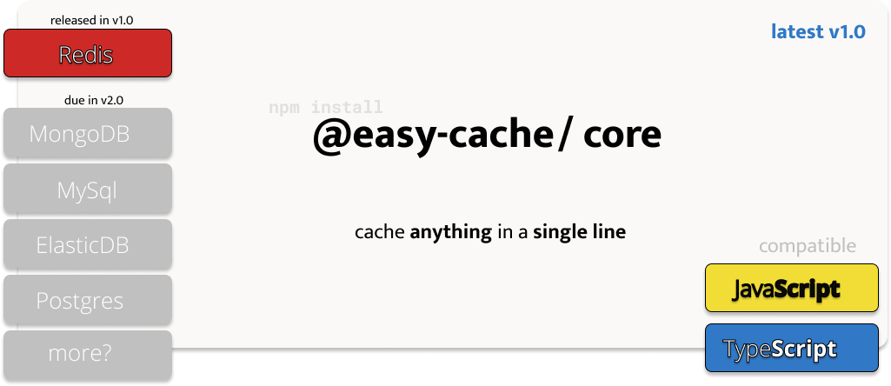

[](https://github.com/YashKumarVerma/easy-cache/actions/workflows/build.yml)
[](https://github.com/YashKumarVerma/easy-cache/actions/workflows/test.yml)


# EasyCache

> A modern NodeJS package to cache any function with just a **single line of code** - @EasyCache

## 🤔 What is EasyCache v1.0?

EasyCache is a NodeJS module available on NPM to cache any function with just a single line of code. It helps you to boost your application in the cleanest way possible. Allows setting global as well as local cache options.

Primary features of @EasyCache are:

- Global configuration options to configure entire application at one place.
- Local configuration option to configure any function as required, overriding the global configs.
- Custom TTL (Time to Live) to customize cache invalidation.
- Built in support for Redis as cache server. (*Others coming in v2.0*)
- brutally tested and production ready.


# Usage
The package is written in typescript and generates the type descriptions using the typescript compiler. It can be directly used in any nodejs based backend by importing the package.

```
npm install --save decorated-cache

# or

yarn add decorated-cache
```


# Roadmap

### Version 1
- @cache decorator to implement caching.
- Support for redis as a provider for caching.

### Version 2
- Support for plugins to add any generic provider.

